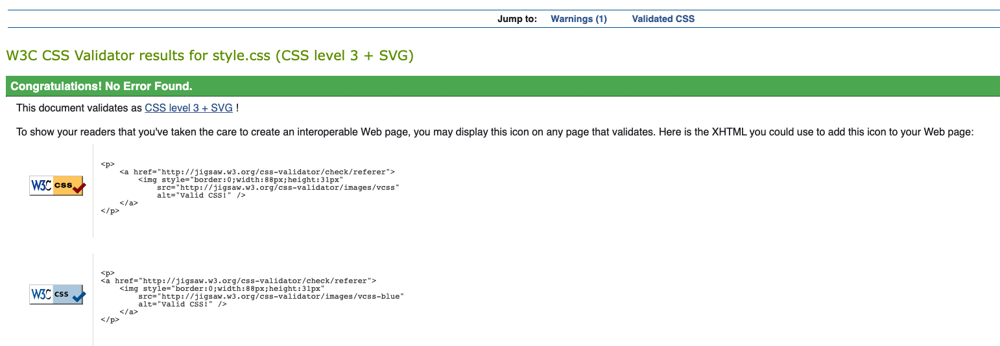
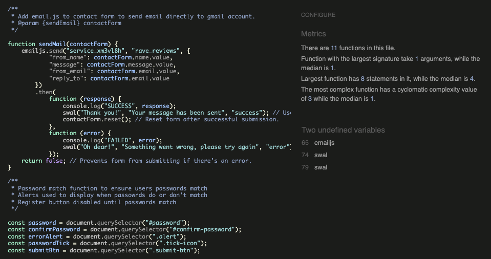

# __Rave Reviews Testing__

[Live webpage](https://rave-reviews-app.herokuapp.com/)

## __Contents__

1. [Automated Testing](#automated-testing)
    * [HTML Validation](#HTML-validation)
    * [CSS Validation](#CSS-validation)
    * [JavaScript Validation](#javascript-validation)
    * [Python Validation](#python-validation)
    * [Accessibility](#accessibility)
    * [Performance](#performance)
2. [Manual Testing](#manuel-testing)
    * [Device testing](#performing-tests-on-various-devices)
    * [Browser compatibility](#browser-compatibility)
    * [Testing user stories](#testing-user-stories)
3. [Bugs](#bugs)

I consistently tested throughout the build of the project with Chrome developer tools, utilising print statements in python and checking for device compatibility at each stage opf the development.
_ _ _ 

## __Automated Testing__

### HTML Validation

The W3C Markup Validation Service was used to validate the HTML of the website. All pages pass with no errors.

Logged Out Home [results](https://validator.w3.org/nu/?doc=https%3A%2F%2Frave-reviews-app.herokuapp.com%2F)

Logged In Home [results](https://validator.w3.org/nu/?doc=https%3A%2F%2Frave-reviews-app.herokuapp.com%2Flogged_in_home)

Log In [results](https://validator.w3.org/nu/?doc=https%3A%2F%2Frave-reviews-app.herokuapp.com%2Flogin)

Register [Results](https://validator.w3.org/nu/?doc=https%3A%2F%2Frave-reviews-app.herokuapp.com%2Fregister)

Profile [Results](https://validator.w3.org/nu/?doc=https%3A%2F%2Frave-reviews-app.herokuapp.com%2Fprofile%2Fdnbharry)

Edit Profile [Results](https://validator.w3.org/nu/?doc=https%3A%2F%2Frave-reviews-app.herokuapp.com%2Fedit_profile%2F644ff1b57bd099cfccc82783)

Get Raves [Results](https://validator.w3.org/nu/?doc=https%3A%2F%2Frave-reviews-app.herokuapp.com%2Fget_raves%2F)

Add Rave [Results](https://validator.w3.org/nu/?doc=https%3A%2F%2Frave-reviews-app.herokuapp.com%2Fadd_rave)

Edit Rave [Results](https://validator.w3.org/nu/?doc=https%3A%2F%2Frave-reviews-app.herokuapp.com%2Fedit_rave%2F64512efa538d5c6ccbaf95c4)

Get Organisations [Results](https://validator.w3.org/nu/?doc=https%3A%2F%2Frave-reviews-app.herokuapp.com%2Fget_organisations)

Add Organisations [Results](https://validator.w3.org/nu/?doc=https%3A%2F%2Frave-reviews-app.herokuapp.com%2Fadd_organisation)

Edit Organisations [Results](https://validator.w3.org/nu/?doc=https%3A%2F%2Frave-reviews-app.herokuapp.com%2Fedit_organisation%2F64568e7130db687d1fc3cac1)

Contact [Results](https://validator.w3.org/nu/?doc=https%3A%2F%2Frave-reviews-app.herokuapp.com%2Fcontact)

Errors [Results](https://validator.w3.org/nu/?doc=https%3A%2F%2Frave-reviews-app.herokuapp.com%2F457hdfr)

### CSS Validation

The W3C Jigsaw CSS Validation Service was used to validate the CSS of the website.
When pasting in my index errors and warnings were flagged all linked to Materialize.

When validating just my own custom CSS file it passes with no errors with only 1 warning as it could not read the Google Fonts import.

style.css

 

### JavaScript Validation

JSHint JS Validation Service was used to validate the Javascript files. No significant issues were found. Only undefined variables flagged were those used for the emailjs functions.

OnClick buttons were flagged as unused, but /* exported */ feature was used to remove the flags as they are called in the html files.

script.js

 

### Python Validation

### Accessibility

To ensure the site is accesible as possible I have taken the following steps;

- Using semantic HTML.
- Descriptive alt attributes on images.
- Label functions and links to ensure clarity of the roles of each button, icon or clickable feature.
- Ensuring that there is a sufficient colour contrast throughout the site - There are contrast flags throughout the WAVE reporting but I am happy with the way the site is represented in these case as a low contrast was my intention and part of the design. I am happy with the visiblility of each flag so have left them as they are and they are all labelled with descriptions.

All pass with no errors.

Logged Out Home [results](https://wave.webaim.org/report#/https://rave-reviews-app.herokuapp.com/)

Logged In Home [results](https://wave.webaim.org/report#/https://rave-reviews-app.herokuapp.com/logged_in_home)

Log In [results](https://wave.webaim.org/report#/https://rave-reviews-app.herokuapp.com/login)

Register [Results](https://validator.w3.org/nu/?doc=https%3A%2F%2Frave-reviews-app.herokuapp.com%2Fregister)

Profile [Results](https://validator.w3.org/nu/?doc=https%3A%2F%2Frave-reviews-app.herokuapp.com%2Fprofile%2Fdnbharry)

Edit Profile [Results](https://validator.w3.org/nu/?doc=https%3A%2F%2Frave-reviews-app.herokuapp.com%2Fedit_profile%2F644ff1b57bd099cfccc82783)

Get Raves [Results](https://validator.w3.org/nu/?doc=https%3A%2F%2Frave-reviews-app.herokuapp.com%2Fget_raves%2F)

Add Rave [Results](https://validator.w3.org/nu/?doc=https%3A%2F%2Frave-reviews-app.herokuapp.com%2Fadd_rave)

Edit Rave [Results](https://validator.w3.org/nu/?doc=https%3A%2F%2Frave-reviews-app.herokuapp.com%2Fedit_rave%2F64512efa538d5c6ccbaf95c4)

Get Organisations [Results](https://validator.w3.org/nu/?doc=https%3A%2F%2Frave-reviews-app.herokuapp.com%2Fget_organisations)

Add Organisations [Results](https://validator.w3.org/nu/?doc=https%3A%2F%2Frave-reviews-app.herokuapp.com%2Fadd_organisation)

Edit Organisations [Results](https://validator.w3.org/nu/?doc=https%3A%2F%2Frave-reviews-app.herokuapp.com%2Fedit_organisation%2F64568e7130db687d1fc3cac1)

Contact [Results](https://validator.w3.org/nu/?doc=https%3A%2F%2Frave-reviews-app.herokuapp.com%2Fcontact)

Errors [Results](https://validator.w3.org/nu/?doc=https%3A%2F%2Frave-reviews-app.herokuapp.com%2F457hdfr)

### Performance