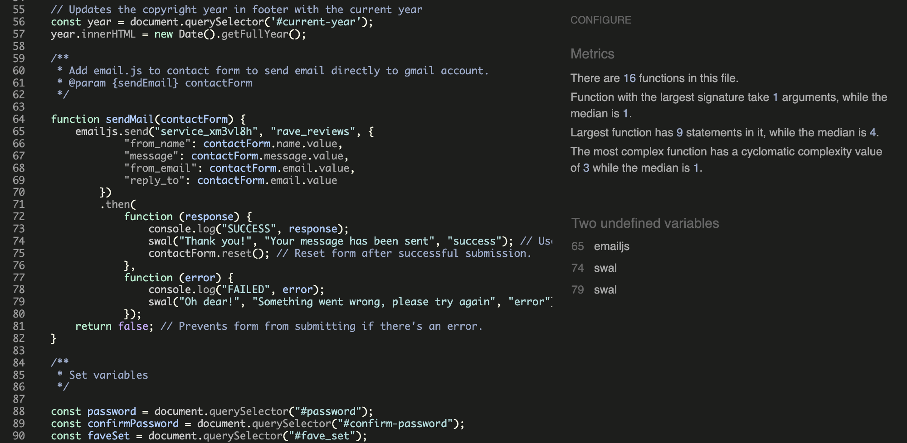
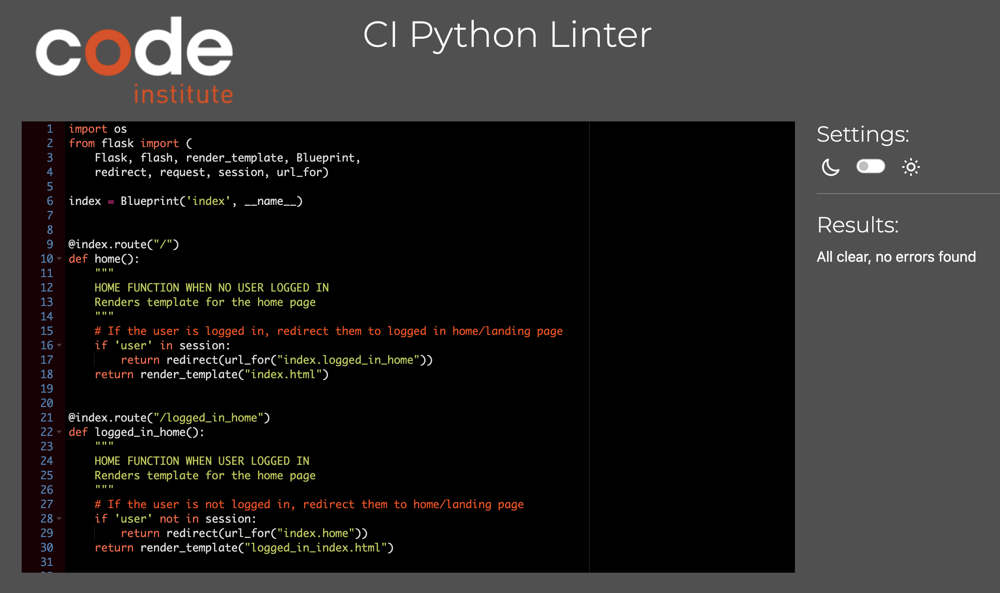
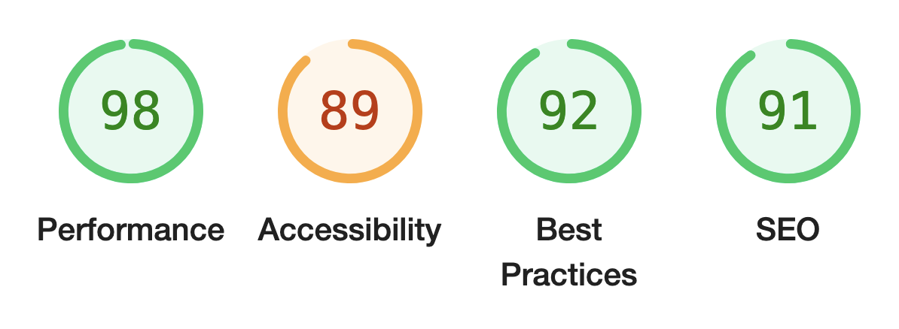
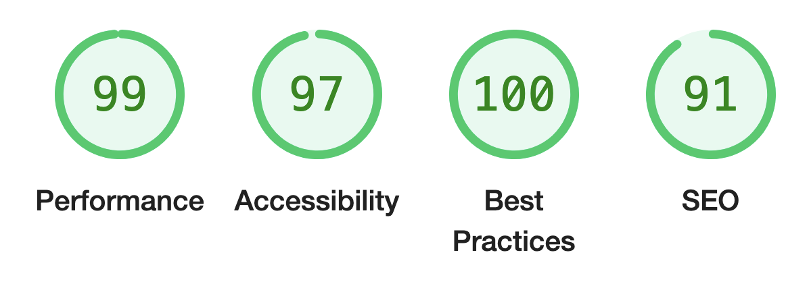

# __Rave Reviews Testing__

[Live webpage](https://rave-reviews-app.herokuapp.com/)

## __Contents__

1. [Automated Testing](#automated-testing)
    * [HTML Validation](#HTML-validation)
    * [CSS Validation](#CSS-validation)
    * [JavaScript Validation](#javascript-validation)
    * [Python Validation](#python-validation)
    * [Accessibility](#accessibility)
    * [Performance](#performance)
2. [Manual Testing](#manuel-testing)
    * [Device testing](#performing-tests-on-various-devices)
    * [Browser compatibility](#browser-compatibility)
    * [Testing user stories](#testing-user-stories)
3. [Bugs](#bugs)

I consistently tested throughout the build of the project with Chrome developer tools, utilising print statements in python and checking for device compatibility at each stage opf the development.
_ _ _ 

## __Automated Testing__

### __HTML Validation__

The W3C Markup Validation Service was used to validate the HTML of the website. All pages pass with no errors.

Logged Out Home [results](https://validator.w3.org/nu/?doc=https%3A%2F%2Frave-reviews-app.herokuapp.com%2F)

Logged In Home [results](https://validator.w3.org/nu/?doc=https%3A%2F%2Frave-reviews-app.herokuapp.com%2Flogged_in_home)

Log In [results](https://validator.w3.org/nu/?doc=https%3A%2F%2Frave-reviews-app.herokuapp.com%2Flogin)

Register [Results](https://validator.w3.org/nu/?doc=https%3A%2F%2Frave-reviews-app.herokuapp.com%2Fregister)

Profile [Results](https://validator.w3.org/nu/?doc=https%3A%2F%2Frave-reviews-app.herokuapp.com%2Fprofile%2Fdnbharry)

Edit Profile [Results](https://validator.w3.org/nu/?doc=https%3A%2F%2Frave-reviews-app.herokuapp.com%2Fedit_profile%2F644ff1b57bd099cfccc82783)

Get Raves [Results](https://validator.w3.org/nu/?doc=https%3A%2F%2Frave-reviews-app.herokuapp.com%2Fget_raves%2F)

Add Rave [Results](https://validator.w3.org/nu/?doc=https%3A%2F%2Frave-reviews-app.herokuapp.com%2Fadd_rave)

Edit Rave [Results](https://validator.w3.org/nu/?doc=https%3A%2F%2Frave-reviews-app.herokuapp.com%2Fedit_rave%2F64512efa538d5c6ccbaf95c4)

Get Organisations [Results](https://validator.w3.org/nu/?doc=https%3A%2F%2Frave-reviews-app.herokuapp.com%2Fget_organisations)

Add Organisations [Results](https://validator.w3.org/nu/?doc=https%3A%2F%2Frave-reviews-app.herokuapp.com%2Fadd_organisation)

Edit Organisations [Results](https://validator.w3.org/nu/?doc=https%3A%2F%2Frave-reviews-app.herokuapp.com%2Fedit_organisation%2F64568e7130db687d1fc3cac1)

Contact [Results](https://validator.w3.org/nu/?doc=https%3A%2F%2Frave-reviews-app.herokuapp.com%2Fcontact)

Errors [Results](https://validator.w3.org/nu/?doc=https%3A%2F%2Frave-reviews-app.herokuapp.com%2F457hdfr)

### __CSS Validation__

The W3C Jigsaw CSS Validation Service was used to validate the CSS of the website.
When pasting in my index errors and warnings were flagged all linked to Materialize.

When validating just my own custom CSS file it passes with no errors with only 1 warning as it could not read the Google Fonts import.

style.css

 

### __JavaScript Validation__

JSHint JS Validation Service was used to validate the Javascript files. No significant issues were found. Only undefined variables flagged were those used for the emailjs functions.

OnClick buttons were flagged as unused, but /* exported */ feature was used to remove the flags as they are called in the html files.

script.js

 

### __Python Validation__

[pep8ci](#https://pep8ci.herokuapp.com/) was the linter used to check the python code, all clear with no errors.
 

Index

Authentication

Raves

Organisations

Error Handlers

 

### __Accessibility__

To ensure the site is accesible as possible I have taken the following steps;

- Using semantic HTML.
- Descriptive alt attributes on images.
- Label functions and links to ensure clarity of the roles of each button, icon or clickable feature.
- Ensuring that there is a sufficient colour contrast throughout the site (There are contrast flags throughout the WAVE reporting but I am happy with the way the site is represented in these case as a low contrast was my intention and part of the design. I am happy with the visiblility of each flag so have left them as they are and they are all labelled with descriptions.)

[Wave accessibility](#https://wave.webaim.org/) was used to test the websites accessibility

All pass with no errors apart from the forms as the drop down option has no form label which is a Materialize feature and something I can not adjust.

Due to the log in WAVE can only access limited links these are sahred for demonstration to how the rest of the sites pages are structured for optimal accessibility.

Logged Out Home [results](https://wave.webaim.org/report#/https://rave-reviews-app.herokuapp.com/)

Log In [results](https://wave.webaim.org/report#/https://rave-reviews-app.herokuapp.com/login)

Register [Results](https://wave.webaim.org/report#/https://rave-reviews-app.herokuapp.com/register)

Errors [Results](https://wave.webaim.org/report#/https://rave-reviews-app.herokuapp.com/profile/)

### __Performance__

Performance testing was done using lighthouse in chrome developer tools testing the performance, accessibility, best practices and SEO of the website. Some of the scores are lower than I'd like them to be but for most of them, the lower ones especialy, it was from labels or formatting within Materialize I which I could not change so it's not something I'm too worried about.
 

Logged Out Home

Logged In Home

Log In

Register

Profile

Edit Profile

Get Raves

Add Rave

Edit Rave

Organisations

Add Organisation

Edit Organisation

Contact

Errors

_ _ _

## __Manuel Testing__

### __Device testing__
The website was tested on the following devices:
- MacBook Pro
- iPad Tablet
- Google Pixel 5
- iPhone 12

In addition, the website was tested using Google Chrome Developer Tools device toggle option for all available device options.

### __Browser Compatibility__

The website was tested on the following browsers:
- Google Chrome
- Apple Safari
- Mozilla Firefox

### __Testing user stories__

| Feature | Expected Outcome | Testing Performed | Result | Pass/Fail |
| --- | --- | --- | --- | --- |
`First Time Visitor Goals`
| Understand what the site is for and how to navigate through site. | Logged out landing home page introduuction explains the use of the site | Go to home page as a new user | Explaintion is clear and present | Pass |
| Register For An Account | User creates an account | Clicks 'Register' links, enters correct details | Account is created | Pass |
| Find & Read Rave Reviews | Once logged in buttons and links will take user to reviews page where all reviews are accessible | Click 'Rave Reviews' buttons or links | Review page and all reviews are loaded | Pass |
| Create Rave Review | User can fill out the form and create a review | Click 'Leave Review' link or button | Form is present, once all necessary fields are fillled out, review is created | Pass |
`Returning Visitor Goals`
__Profile__
| View Profile | Once logged in user is directed to their profile page | User logs in | Profile page is loaded with all information of the user | Pass |
| Edit Profile | If user is on their profile page, user can edit their profile | Click 'Edit Profile' button | Edit profile page with information pre-populated on the form | Pass |
| Delete Profile | If user is their profile page, user can delete their profile | Click 'Delete Profile' button | Defenisve modal pops up asking user to confirm the deletion of the specified profile, once delelted user is redirected to the logged out home page | Pass |
__Log In__
| Log In To My Account | Registered user can log in via the log in button and navbar link | Clicks links, enters correct details | User logged in | Pass |
__Reviews__
| Create Rave Review | User can fill out the form and create a review | Click 'Leave Review' link or button | Form is present, once all necessary fields are fillled out, review is created | Pass |
| Read Rave Review | Once logged in user can find reviews and read all reviews from other members | Click 'Rave Reviews' link | Rave review page is loaded with all reviews available | Pass |
| Edit Rave Review | If review is the user's, user can edit the review | Click 'Edit Review' button | Edit review page with information pre-populated on the form | Pass |
| Delete Rave Review | If review is the user's, user can delete the review | Click 'Delete Review' button | Defenisve modal pops up asking user to confirm the deletion of the specified review, once delete user is redirected to the rave reviews page | Pass |
__Search__
| Search For Rave Reviews | User can use the search bar to search for specific reviews | Type in different reviews by name, venue and title key words | Search brings up the inteded specified reviews | Pass |
| --- | --- | --- | --- | --- |
`Admin User`
| Add or Remove Organisations Privilege | If logged in as Admin access to organisations, if not redirect to home page  | Attempted to load organisation pages as user and Admin | If user not admin redirected to home page, if admin access allowed | Pass |
| Remove Content Privilege | Only access to delete offensive reviews is Admin | Delete button present on all reviews for Admin. Button only present to user's personal reviews | Review deleted | Pass |
`Site Owner` 
| Defensive Programming (user in session) | When user logged out any page only for liged in access will automatically redirect to the logged outhome page | Attempt to enter pages for logged In Access Only | Redirected to home page | Pass |
| Defensive Prgramming (deletion) | Before any deletion a modal pops up confirming the user wishes to delete | Attempt to delete Organisation, Profile & Review | Defensive modal pops up | Pass |
| Error Page | Button redirects the user to the home page | Clicked button | Redirected to home page | Pass |
_ _ _

## __Bugs__
